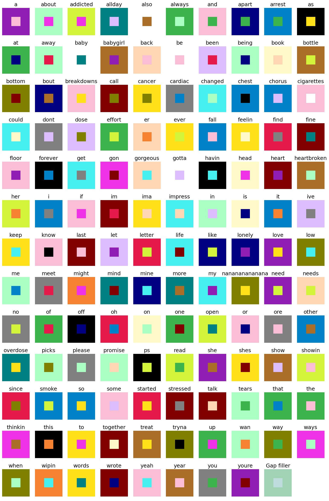

# lyrics_visualization
Choose a song lyric from genius.com and create your individual visualization of the song lyric. The result is an image where each pixel represents one word:

)

But how to read it without a dictionary?! 

You can create such an image for every song which you can find on genius.com. The default code can handle texts with up to 462 unique words, otherwise you need to add some more colors.
